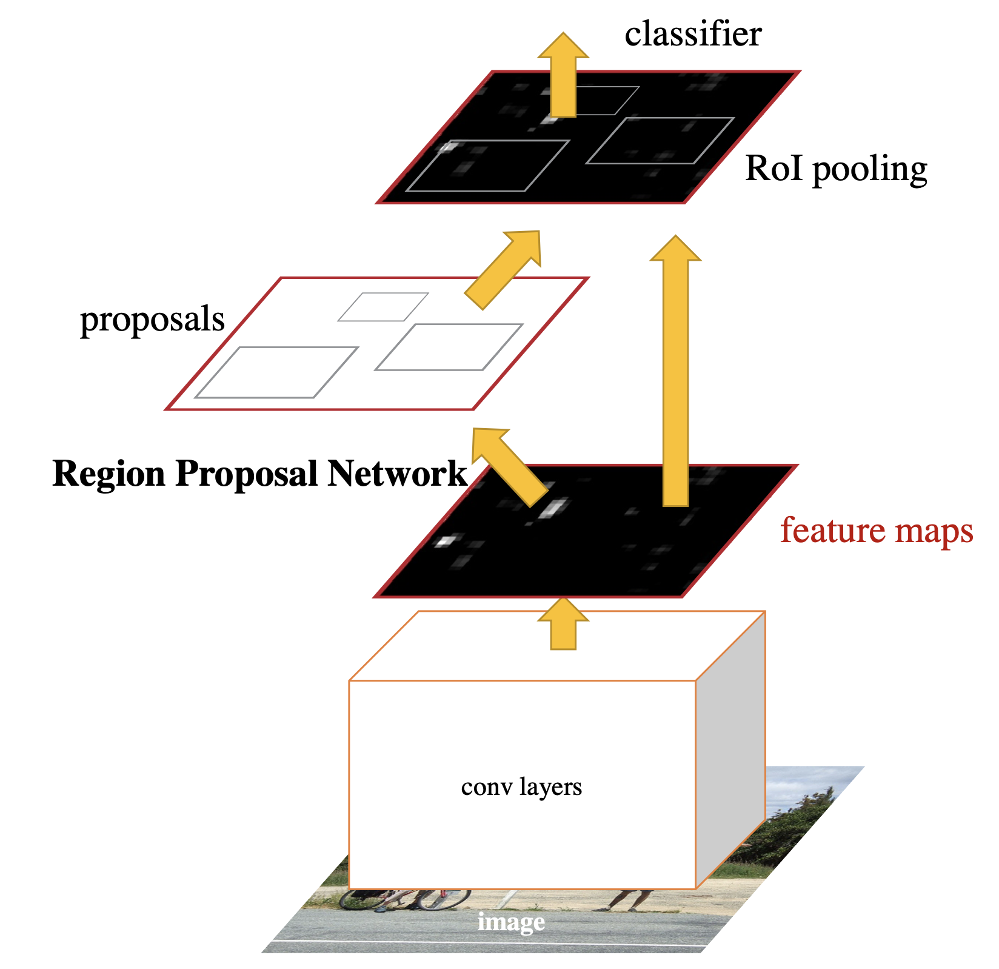
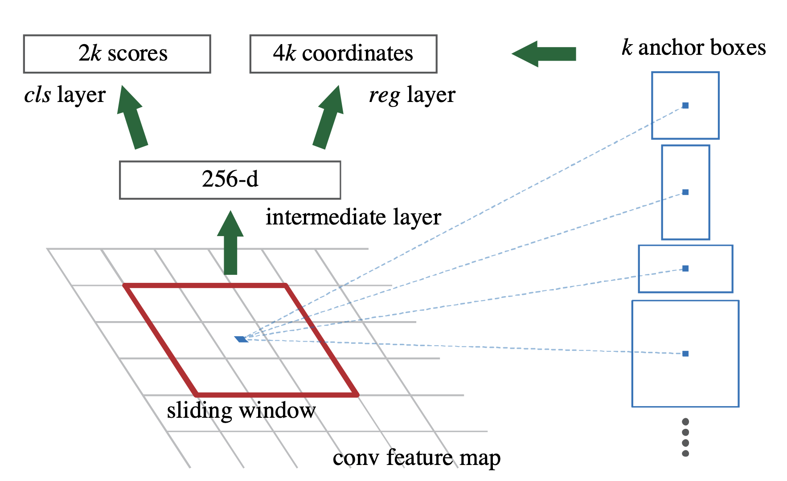
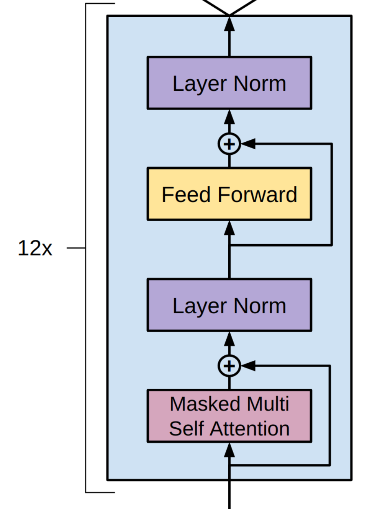

---
hide:
  - navigation
---

# 检测模型

更新时间：2024 年 5 月

## 模型概览

### 目标检测模型

下面几个模型是比较经典的检测模型：

* 【1】SSD 2015——经典的 OneStage 模型
* 【2】Faster R-CNN 2015——经典的 TwoStage 模型
* 【3】YOLO v3 2018——速度较快的检测模型
* 【4】CenterNet 2019——AnchorFree 模型
* 【5】DETR 2020——使用 Transformer 做检测任务的模型
* 【6】YOLO v5 2020——速度较快的检测模型

它们在 COCO2017 上的分数如下：

### 实例分割模型

下面几个模型是比较经典的实例分割模型：

* 【1】Mask R-CNN 2017——现代化的实例分割模型
* 【2】Cascade Mask R-CNN 2019——级联的 Mask R-CNN
* 【3】QueryInst 2021——目前排行榜第 10 名
* 【4】SwinV2 2021——目前排行榜第 1 名

它们在 COCO2017 上的分数如下：

## 具体模型介绍

### SSD 2015

[SSD: Single Shot MultiBox Detector](https://arxiv.org/abs/1512.02325)

SSD 是 OneStage 的模型，因为没有 RPN、ROI 等操作，所以速度会快很多，代价在于精度有所降低。

YOLO 与 SSD 的结构也是类似的，不过一代的 YOLO 没有使用中间层的特征。

模型结构如下：

### YOLOv5 2022

* [YOLOv5](https://github.com/ultralytics/yolov5)
* [YOLOv5中文解析](https://zhuanlan.zhihu.com/p/172121380)

YOLOv5 仍然是属于 OneStage 模型，对结构进行了许多优化，降低了计算量。各种数据增强方法也提高了模型的精度。

### Faster R-CNN 2015

[Faster R-CNN: Towards Real-Time Object Detection with Region Proposal Networks](https://arxiv.org/abs/1506.01497)

Faster R-CNN 是最经典的 TwoStage 模型。 使用 RPN 提取出可能是物体的区域，然后使用 ROI Pooling 抓出局部特征， 再使用分类和回归将类别和框的位置计算出来。

下图就是 FPN 结构的示意：

下图是检测头的结构：

### DETR 2020

[End-to-End Object Detection with Transformers](https://arxiv.org/abs/2005.12872)

DETR 仍然是使用 CNN 提取特征，不过没有使用传统的 RPN 和检测 Head，因此也没有 Anchor，使用了 Transformer 直接检测物体。

DETR 结构：

Transformer 结构：

Multi-Head Attention 结构：

Attention 结构：

### Mask R-CNN 2017

[Mask R-CNN](https://arxiv.org/abs/1703.06870)

经典的 TwoStage 模型，检测部分和 Faster R-CNN 一样，先提取可能是物体的部分，然后再提取这部分区域的特征计算类别和框，但是多了一个 Mask 分支，用于逐像素分类，计算该物体的 Mask。

### Cascade Mask R-CNN 2019

[Cascade R-CNN: High Quality Object Detection and Instance Segmentation](https://arxiv.org/abs/1906.09756)

将模型的结果再输入到新的模型里做精调，反复几次，这样可以提升模型的准确率，但是也会增加计算量。

## 模型可视化对比

为了综合评价各个模型的能力，我们使用各个模型对下图进行了推断和可视化：

| 模型名称                   | 年份   | bbox mAP | 可视化图                                                                                                                                                                                                                                    |
|------------------------|------|----------|-----------------------------------------------------------------------------------------------------------------------------------------------------------------------------------------------------------------------------------------|
| SSD Lite MobileNetV2   | 2015 | 21.3     |                                                |
| YOLOv3                 | 2018 | 33.7     |                                                |
| YOLOv5s                | 2022 | 37.4     |                                                                                                                                                              |
| YOLOv5x6               | 2022 | 55.0     |                                                                                                                                                            |
| Faster R-CNN R50       | 2015 | 38.4     |                                                    |
| Mask R-CNN R50         | 2017 | 39.2     |                                              |
| Cascade Mask R-CNN R50 | 2019 | 44.3     |                                        |
| DETR R50               | 2020 | 39.9     |                                                                              |
| Swin R50               | 2021 | 46.0     |                                      |
| QueryInst R50          | 2021 | 47.5     |  |
| DINO Swin-L | 2022 | 58.4 |  |
| Grounding DINO Swin-L | 2023 | 59.7 |  |

本表格的数据可以使用此脚本跑出：[visualize_models_mmdet3.py](detection-models/visualize_models_mmdet3.py)

可以看到，不是 mAP 分数更高的模型就更准，目前基于 Anchor 的模型依然具备极大的优势。
