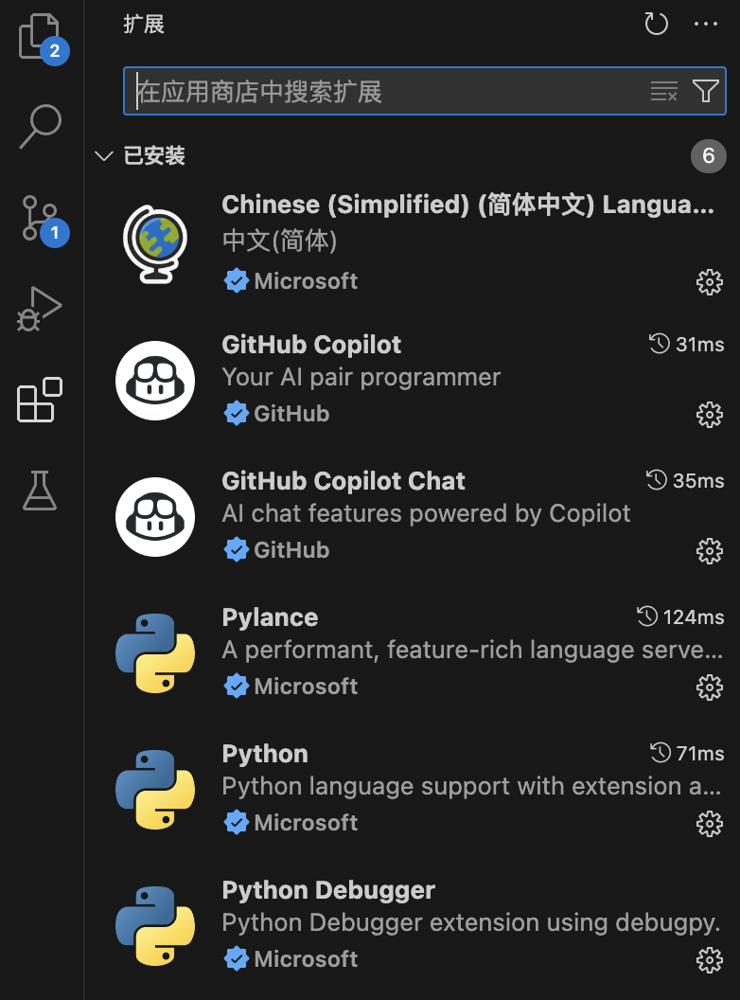
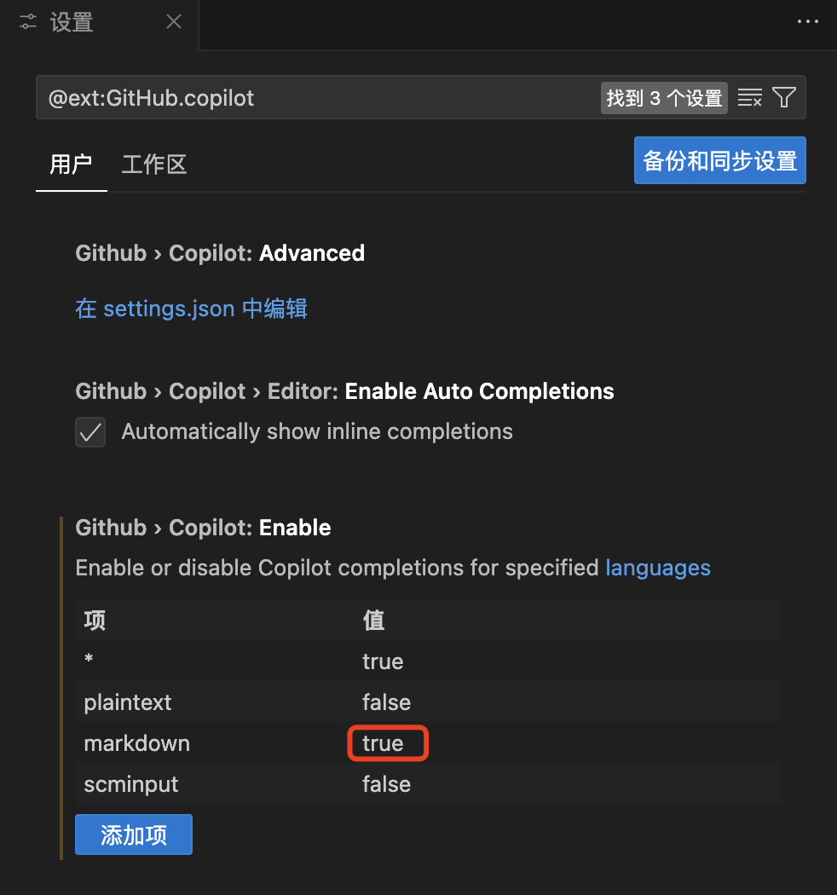
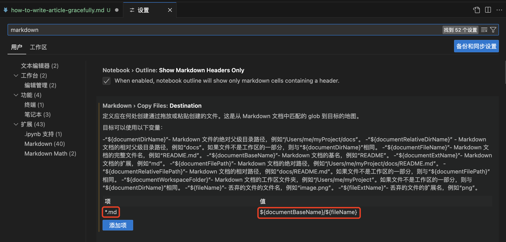
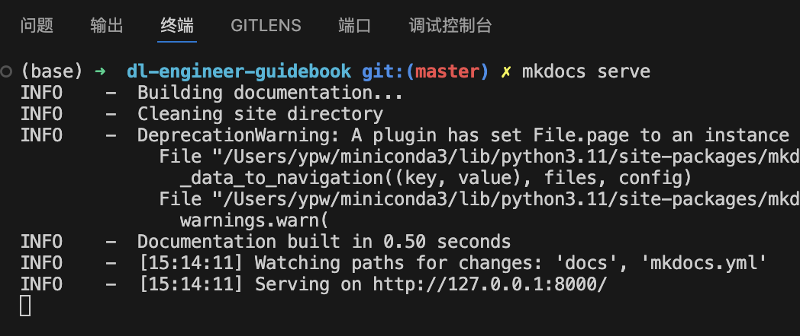
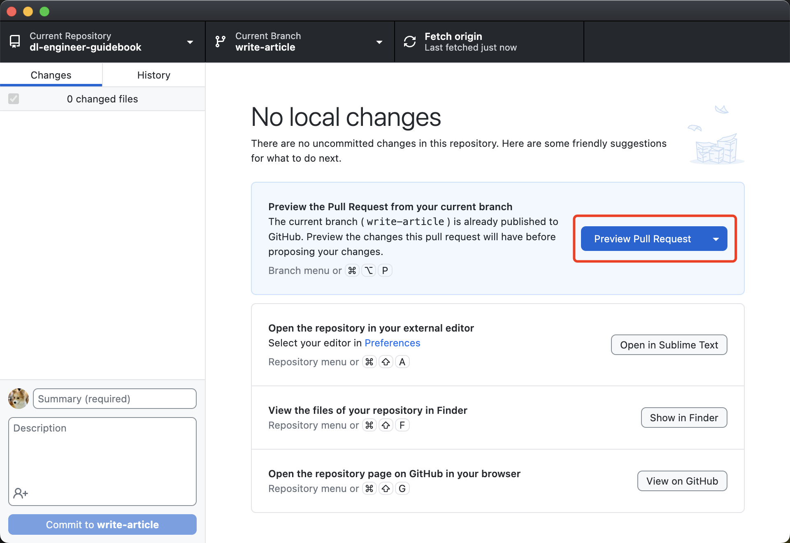

# 如何优雅地写文章

我写文章的 IDE 是 Visual Studio Code，优点是有两个，一个是轻量级，打开速度快，一个是支持很多插件，比如 GitHub Copilot。

## 下载 Visual Studio Code

官网地址：[https://code.visualstudio.com/](https://code.visualstudio.com/)

如果你用的是 Mac，直接使用下面的命令安装即可：

```sh
brew install --cask visual-studio-code
```

## 安装插件

我用了这几个插件：

* 中文插件：[url](https://marketplace.visualstudio.com/items?itemName=MS-CEINTL.vscode-language-pack-zh-hans)
* GitHub Copilot：[url](https://marketplace.visualstudio.com/items?itemName=GitHub.copilot)



## 配置 GitHub Copilot

首先是登录，不需要讲，然后是调整支持的文件，添加对 markdown 的支持：



## 配置粘贴图片到文件夹下

如果直接粘贴图片，vscode 会放在 markdown 同级目录下，个人认为文件会比较乱。我们可以在设置里修改一下，让 vscode 存到同名文件夹下。

首先搜索 markdown，然后在 markdown.copyFiles.destination 设置里添加一个配置：



为了方便复制，我把内容贴在这里：

```
*.md
${documentBaseName}/${fileName}
```

这样配置以后，比如我在 how-to-write-article-gracefully.md 里粘贴图片，就会存成这样的格式：

```
├── how-to-use-tensorboard.md
└── how-to-write-article-gracefully
    ├── image-1.png
    ├── image-2.png
    └── image.png
```

## 配环境

如果你是第一次写文章，没安装过 mkdocs，可以在项目文件夹下，使用下面的命令安装：

```sh
pip install -r requirements.txt
```

安装 mkdocs 和 mkdocs-material 主题。

## 写文章

写文章之前，一定要先开分支，写一点，提交一点。这样即使写到一半，突然有事，也不会丢失。回家可以直接切分支继续写。

写文章的时候，可以在项目文件夹下，使用 mkdocs serve 命令，实时预览效果。

```sh
mkdocs serve
```



然后你就可以在浏览器里访问 [http://127.0.0.1:8000/](http://127.0.0.1:8000/) 看到预览效果了：


## 提交合并请求

写完文章以后，可以提交合并请求：



也可以在 GitHub 网页上操作。

提交之后，你可以在 GitHub 上看到此合并请求：

[https://github.com/ypwhs/dl-engineer-guidebook/pull/43](https://github.com/ypwhs/dl-engineer-guidebook/pull/43)

## 自动化部署

如果我点击合并代码，最新的代码会自动编译，并且推送到服务器上。这是因为我写了 GitHub Action 配置：

[https://github.com/ypwhs/dl-engineer-guidebook/blob/master/.github/workflows/build.yml](https://github.com/ypwhs/dl-engineer-guidebook/blob/master/.github/workflows/build.yml)

这个脚本用了以下几个操作流程：

```yaml
jobs:
  build:
    runs-on: ubuntu-latest
    steps:
      - uses: actions/checkout@v2

      - name: Deploy docs
        uses: mhausenblas/mkdocs-deploy-gh-pages@1.23
        env:
          GITHUB_TOKEN: ${{ secrets.GITHUB_TOKEN }}
          CONFIG_FILE: mkdocs.yml
          EXTRA_PACKAGES: build-base

      - name: rsync via ssh key
        uses: burnett01/rsync-deployments@4.1
        with:
          switches: -avzr --delete
          remote_host: ${{ secrets.HOST }}
          remote_user: ${{ secrets.USERNAME }}
          remote_port: ${{ secrets.PORT }}
          remote_key: ${{ secrets.KEY }}
          path: "./site/"
          remote_path: "/home/ypw/nginx/data/dl-engineer-guidebook"
```

* actions/checkout@v2 是检出代码
* mhausenblas/mkdocs-deploy-gh-pages@1.23 是编译文档
* burnett01/rsync-deployments@4.1 是把编译好的文档同步到服务器上

比如这次编译：[https://github.com/ypwhs/dl-engineer-guidebook/actions/runs/8748978746/job/24009848056](https://github.com/ypwhs/dl-engineer-guidebook/actions/runs/8748978746/job/24009848056)

编译文档：


同步到服务器：


## 总结

* 使用 Visual Studio Code 写文章，轻量化 IDE，支持插件
    * GitHub Copilot 会给你一些提示，增加写文章的效率
    * 粘贴图片可以自动归档到文件夹下，保持目录结构的整洁
* 使用 mkdocs serve 实时预览效果
* 提交合并请求可以让代码历史不混乱，并且可以多人协作
* 自动化部署可以减少你的重复工作
