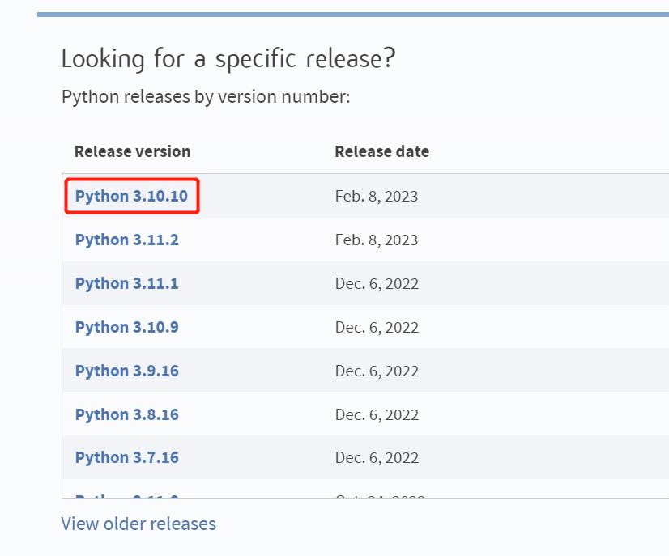
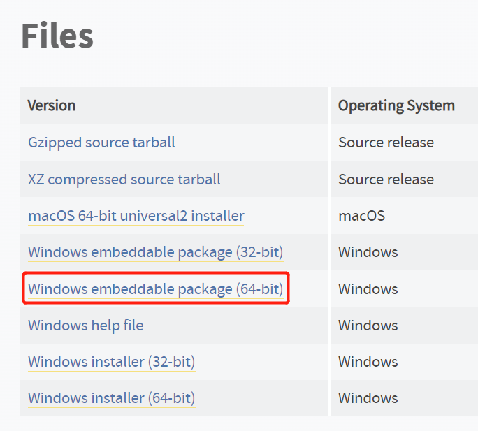
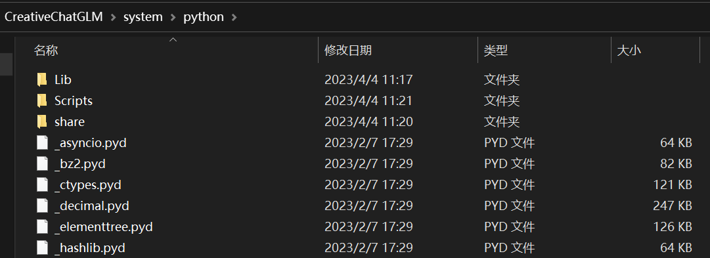
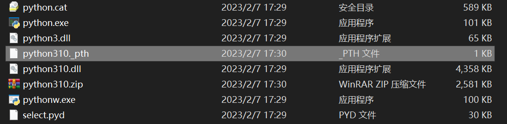
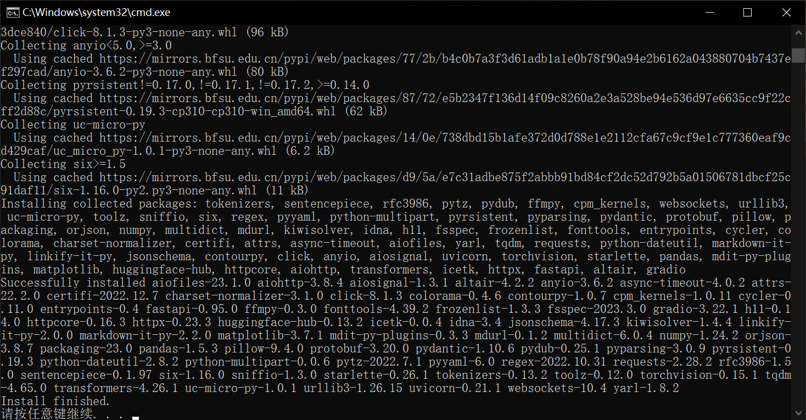
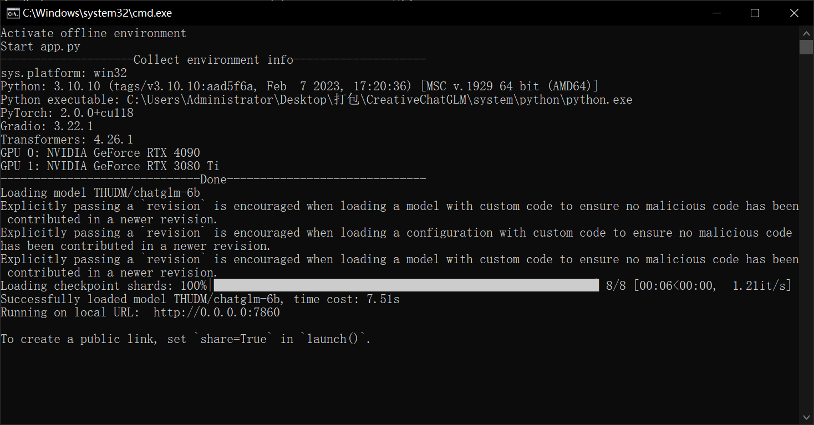

# Windows 离线 Python 环境

## 背景

我们做好了一个程序，想要分发给用户时，用户可能没有网络，无法使用 pip 安装相应的依赖，有时也只是为了方便分发，避免一整天都在处理各种不同的环境问题，那么我们就需要做一个离线 Python 环境。一个离线环境包可以让用户使用和我们一样的 Python 环境，用户只需要学会解压，无需学习 Python，pip 等概念，就可以使用我们的程序。

我在做 CreativeChatGLM 项目时，需要把整个环境打包成一个离线包，因此写了这个教程，链接：[https://github.com/ypwhs/CreativeChatGLM](https://github.com/ypwhs/CreativeChatGLM)

制作过程分为以下几个步骤：

* 准备 Python
* 准备 get-pip.py
* 准备环境变量脚本 env_offline.bat
* 准备安装依赖脚本 setup_offline.bat
* 安装依赖
* 准备运行脚本 start_offline.bat

## 准备 Python

首先去 Python 官网下载：[https://www.python.org/downloads/](https://www.python.org/downloads/)

这里我选择的是 Python 3.10.10：



点进去之后，要下载 Windows embeddable package (64-bit) 版本，代表可以嵌入到其他程序中，这里我选择的是 python-3.10.10-embed-amd64.zip。



解压到工程目录下即可，这里我解压到了 `./system/python` 目录下：



## 准备 get-pip.py

去官网下载：[https://bootstrap.pypa.io/get-pip.py](https://bootstrap.pypa.io/get-pip.py)

保存到 `./system/python` 目录下。

!!! 注意
    解压之后，记得删除 pth 文件，以解决安装依赖的问题。

比如我删除的文件路径是 `./system/python/python310._pth`



## 准备环境变量脚本 env_offline.bat

一个软件如果有很多依赖，要想运行起来就必须正确配置环境变量。可以这么说，一个软件的安装过程，就是解压 + 配置环境变量（Windows 还有注册表）。

这里我写了一个脚本，用于配置 Python 所需的环境变量，保存到工程目录下即可：

```bat
@echo off

echo Activate offline environment

set DIR=%~dp0system

set PATH=C:\Windows\system32;C:\Windows;%DIR%\git\bin;%DIR%\python;%DIR%\python\Scripts;%DIR%\python\Lib\site-packages\torch\lib
set PIP_INSTALLER_LOCATION=%DIR%\python\get-pip.py
```

## 准备安装依赖脚本 setup_offline.bat

安装依赖我也写了个脚本，主要是检查 pip、安装 pytorch 和 requirements.txt 中的依赖，你可以根据你的需要，修改 torch 的版本，或者添加其他依赖：

```bat
cd /D "%~dp0"

echo Setup offline environment
call env_offline.bat

:install_pip
if exist %DIR%\python\Scripts\pip.exe goto :install_python_packages
echo Install pip...
python %PIP_INSTALLER_LOCATION%

:install_python_packages
echo Install dependencies...
pip install torch==2.0.0+cu118 --index-url https://download.pytorch.org/whl/cu118 --extra-index-url https://mirrors.bfsu.edu.cn/pypi/web/simple
pip install -r requirements.txt -i https://mirrors.bfsu.edu.cn/pypi/web/simple

echo Install finished.
pause
```

## 安装依赖

运行 setup_offline.bat 脚本，安装依赖，可以看到类似下面的输出：



## 准备运行脚本 start_offline.bat

运行脚本就是激活运行环境，以及运行你的程序，这里我写了一个简单的脚本，你可以根据你的需要修改：

```bat
@echo off

cd /D "%~dp0"

call env_offline.bat
call start.bat
```

start.bat 是你的程序启动脚本，这里我只是简单的调用了一个 Python 脚本：

```bat
@echo off

cd /D "%~dp0"

echo Start app.py
python app.py %*

pause
```

## 运行程序

使用 start_offline.bat 启动服务：



从图上可以看到，服务正常启动，它使用了我们在桌面上的打包文件夹里的 python，并且 pytorch 和其他依赖也和我们配置的一样，这样就可以保证用户使用我们的程序时，不会出现各种环境问题。就算你把这个文件夹放在其他位置，程序也能根据相对路径，正确配置环境变量。

