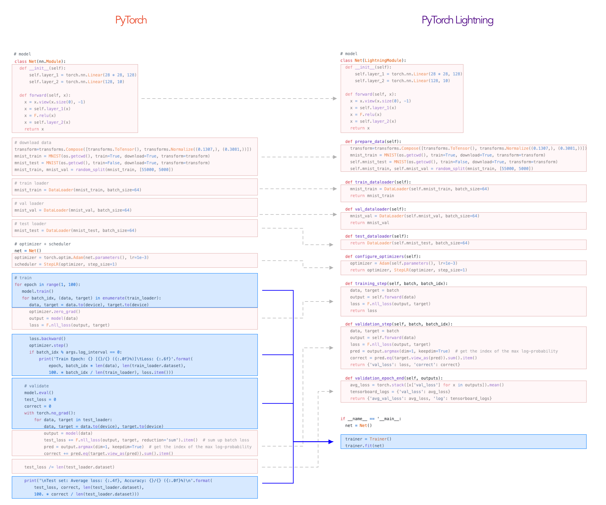
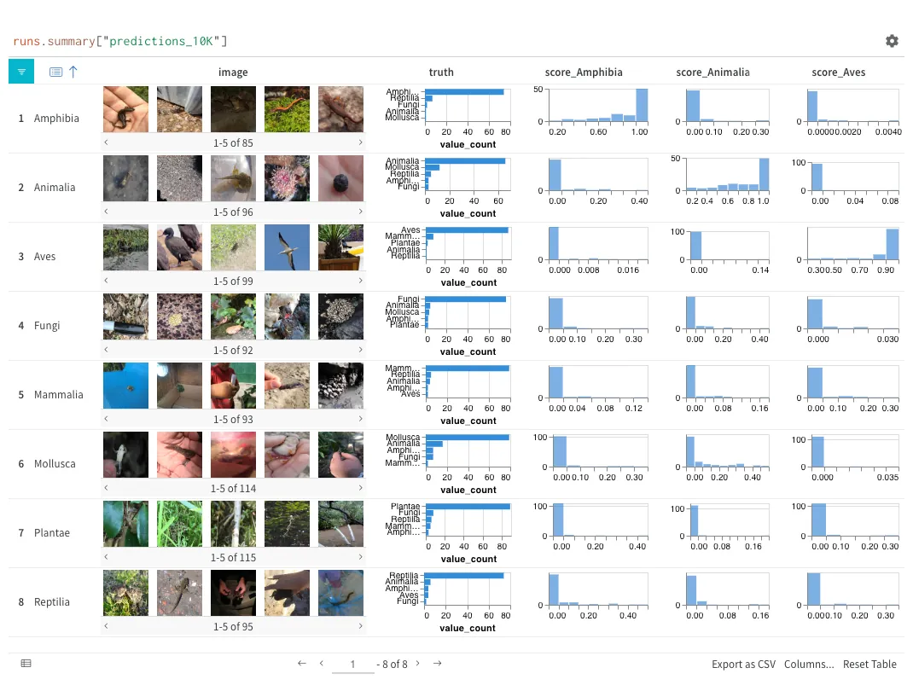
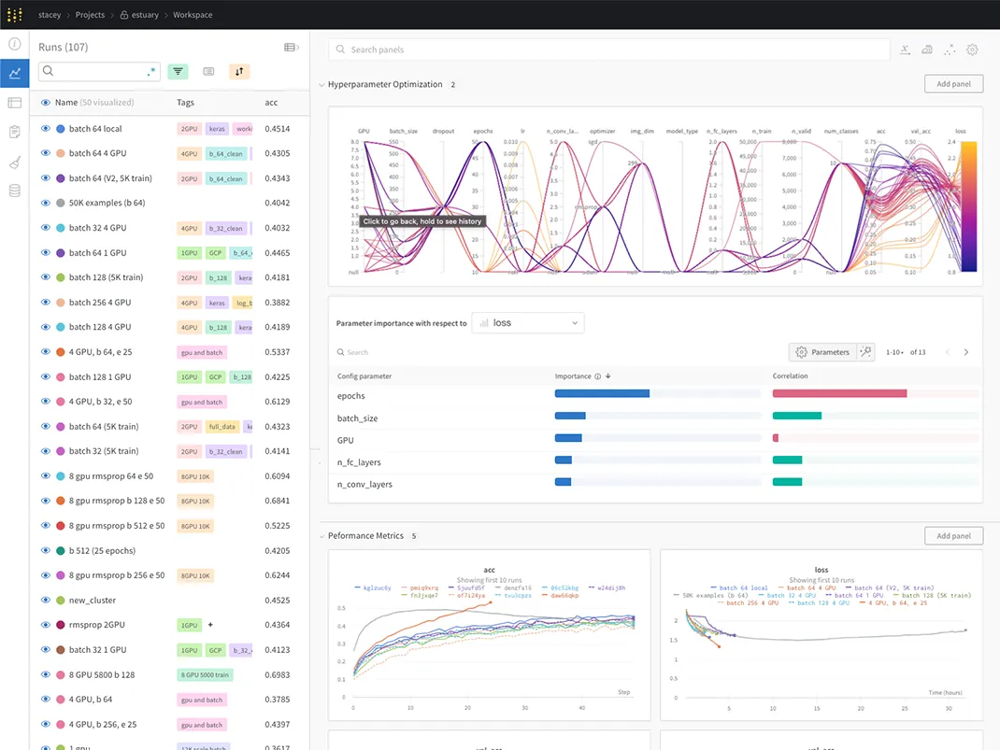

# Python 环境

更新时间：2024-4-23

对于深度学习工程师来说，Python 是必不可少的工具，因为大多数深度学习框架都支持 Python（比如 PyTorch 等）。在模型开发阶段，使用 Python 非常方便，如果配合 Jupyter Notebook 使用，还可以进一步提升开发效率。

## [Miniconda](https://docs.anaconda.com/free/miniconda/)

Miniconda 是一个 Python 环境管理工具，它可以帮助你创建多个 Python 环境，每个环境可以有不同的 Python 版本和库。它的大小比 Anaconda 小很多，Anaconda 是一个大礼包，里面包含了很多库，而 Miniconda 只包含了 Python 和 conda，你可以根据自己的需求安装其他库。我个人比较喜欢安装 Miniconda。

你可以先下载安装包，然后使用 bash 安装 Miniconda，也可以使用 brew 安装。

### bash 安装

[下载](https://docs.anaconda.com/free/miniconda/) 最新的 miniconda 安装包。

20240423 下载的是 `Miniconda3-latest-MacOSX-arm64.sh`

* 需要使用 brew 安装 [wget](macos-environment.md#_9) 命令
* 如果遇到网络问题，可以使用[清华大学的镜像](https://mirrors.tuna.tsinghua.edu.cn/anaconda/miniconda/)，如 [https://mirrors.tuna.tsinghua.edu.cn/anaconda/miniconda/Miniconda3-latest-MacOSX-arm64.sh](https://mirrors.tuna.tsinghua.edu.cn/anaconda/miniconda/Miniconda3-latest-MacOSX-arm64.sh)

```bash
wget https://mirrors.tuna.tsinghua.edu.cn/anaconda/miniconda/Miniconda3-latest-MacOSX-arm64.sh
bash Miniconda3-latest-MacOSX-arm64.sh
```

默认安装路径是 `~/miniconda3`，如果你的用户名是 ypw，那么安装路径就是 `/Users/ypw/miniconda3`。

安装 Miniconda 后，会自动将 Miniconda 的路径添加到环境变量中，但是需要关闭并重新打开 shell 才能生效。
如果需要在当前终端会话中立即生效，可以使用以下命令：

```bash
source ~/.zshrc
```

### brew 安装

```bash
brew install --cask miniconda
```

此时，conda 会安装在这个路径下 `/opt/homebrew/bin/conda`。

检查 miniconda 是否安装成功：

```bash
conda --version
```

### 配置环境变量

安装好以后，有可能需要手动[配置环境变量](linux-command.md#export)，如果你使用的是 zsh，你需要为 zsh 初始化：

```bash
~/miniconda3/bin/conda init zsh
```

执行以后，在 `~/.zshrc` 中可以看到下面的内容：

```bash
# >>> conda initialize >>>
# !! Contents within this block are managed by 'conda init' !!
__conda_setup="$('/Users/ypw/miniconda3/bin/conda' 'shell.zsh' 'hook' 2> /dev/null)"
if [ $? -eq 0 ]; then
    eval "$__conda_setup"
else
    if [ -f "/Users/ypw/miniconda3/etc/profile.d/conda.sh" ]; then
        . "/Users/ypw/miniconda3/etc/profile.d/conda.sh"
    else
        export PATH="/Users/ypw/miniconda3/bin:$PATH"
    fi
fi
unset __conda_setup
# <<< conda initialize <<<
```

### 使用 conda 创建其他 Python 环境

如果我们需要其他 Python 环境，可以使用 conda 创建：

```bash
conda create -n python310 python=3.10
conda activate python310
```

参考链接：[https://conda.io/projects/conda/en/latest/user-guide/tasks/manage-environments.html](https://conda.io/projects/conda/en/latest/user-guide/tasks/manage-environments.html)

### 切换 conda 源

如果遇到网络问题，可以使用[清华大学的镜像](https://mirror.tuna.tsinghua.edu.cn/help/anaconda/)：

```bash
nano ~/.condarc

# 添加下面的内容
channels:
  - defaults
show_channel_urls: true
default_channels:
  - https://mirrors.tuna.tsinghua.edu.cn/anaconda/pkgs/main
  - https://mirrors.tuna.tsinghua.edu.cn/anaconda/pkgs/r
  - https://mirrors.tuna.tsinghua.edu.cn/anaconda/pkgs/msys2
custom_channels:
  conda-forge: https://mirrors.tuna.tsinghua.edu.cn/anaconda/cloud
  msys2: https://mirrors.tuna.tsinghua.edu.cn/anaconda/cloud
  bioconda: https://mirrors.tuna.tsinghua.edu.cn/anaconda/cloud
  menpo: https://mirrors.tuna.tsinghua.edu.cn/anaconda/cloud
  pytorch: https://mirrors.tuna.tsinghua.edu.cn/anaconda/cloud
  pytorch-lts: https://mirrors.tuna.tsinghua.edu.cn/anaconda/cloud
  simpleitk: https://mirrors.tuna.tsinghua.edu.cn/anaconda/cloud
  deepmodeling: https://mirrors.tuna.tsinghua.edu.cn/anaconda/cloud/
```

### 切换 pip 源

如果遇到网络问题，可以使用阿里云的镜像：

```bash
pip config set global.index-url https://mirrors.aliyun.com/pypi/simple/
```

常用 pypi 镜像：

* https://mirrors.aliyun.com/pypi/simple/
* https://pypi.tuna.tsinghua.edu.cn/simple/
* https://mirrors.163.com/pypi/simple/
* https://pypi.doubanio.com/simple/
* https://mirrors.ustc.edu.cn/pypi/web/simple/

## Python 库

下面是我认为比较重要的 Python 库：

* jupyter
* numpy
* matplotlib
* opencv-python
* pillow
* tqdm
* torch
* torchvision
* pytorch-lightning
* wandb

安装大礼包：

```bash
pip install jupyter jupyter_contrib_nbextensions numpy pandas flask fastapi scikit-image scikit-learn matplotlib opencv-python pillow tqdm openpyxl ninja xtcocotools json_tricks munkres shapely ftfy pytest regex pyyaml yapf cython build twine memory_profiler transformers accelerate datasets pytorch-lightning wandb
```

### [jupyter](https://jupyter.org/)

在实验阶段，强烈建议你使用 jupyter notebook 编写实验代码，因为它与写 Python 脚本的逻辑完全不同。

官方介绍：

> Jupyter Notebook是一个开源Web应用程序，允许您创建和共享包含实时代码，公式，可视化和叙述文本的文档。用途包括：数据清理和转换，数值模拟，统计建模，数据可视化，机器学习等。

特点：

* web页面交互，在各个平台甚至是手机上都有同样的界面
* 运行过的代码产生的变量、函数、类不会消失，除非你重启内核
* 不仅支持写代码，显示函数输出的文字，还支持显示图片，甚至实现简单的交互功能
* 支持 Markdown 编写注释，还支持 latex 公式

### [jupyter\_contrib\_nbextensions](https://github.com/ipython-contrib/jupyter_contrib_nbextensions)

Jupyter Notebook 插件。

> 该`jupyter_contrib_nbextensions`软件包包含一系列社区贡献的非官方扩展，可为Jupyter笔记本添加功能。这些扩展大多是用Javascript编写的，将在您的浏览器中本地加载。

我使用了[代码执行时间插件](https://jupyter-contrib-nbextensions.readthedocs.io/en/latest/nbextensions/execute_time/readme.html)和[函数折叠插件](https://jupyter-contrib-nbextensions.readthedocs.io/en/latest/nbextensions/codefolding/readme.html)。

### [numpy](https://numpy.org/)

科学计算必备库。

> NumPy是Python语言的一个扩展程序库。支持高端大量的维度数组与矩阵运算，此外也针对数组运算提供大量的数学函数库。

### [pandas](https://pandas.pydata.org/)

操作 csv 非常方便，python 里的 excel。

> _pandas_是一个开源的，BSD许可的库，为Python编程语言提供高性能，易于使用的数据结构和数据分析工具。

### [scikit-learn](https://scikit-learn.org/)

机器学习模型大全。

> Python中的机器学习
>
> * 简单有效的数据挖掘和数据分析工具
> * 可供所有人访问，并可在各种环境中重复使用
> * 基于NumPy，SciPy和matplotlib构建
> * 开源，商业上可用 - BSD许可证

注意安装的时候不是 sklearn，而是 scikit-learn：

```python
pip install scikit-learn
```

### [matplotlib](https://matplotlib.org/)

画图工具。

> Matplotlib是一个Python 2D绘图库，可以生成各种硬拷贝格式和跨平台的交互式环境的出版物质量数据。Matplotlib可用于Python脚本、IPython shell、Jupyter Notebook 和 Web应用程序服务器和四个图形用户界面工具包。

### [opencv-python](https://pypi.org/project/opencv-python/)

[OpenCV](https://opencv.org/) 的 Python 库，图像处理必备。注意这不是官方的库，而是第三方编译的库。

> OpenCV的全称是Open Source Computer Vision Library，是一个跨平台的计算机视觉库。

官方建议是从源码编译：[https://docs.opencv.org/3.4.6/d2/de6/tutorial\_py\_setup\_in\_ubuntu.html](https://docs.opencv.org/3.4.6/d2/de6/tutorial_py_setup_in_ubuntu.html)

如果你使用的功能不是很复杂，那么你可以直接使用 pip 安装 [opencv-python](https://pypi.org/project/opencv-python/)。如果你使用了 opencv-contrib 里的功能，可以安装 [opencv-contrib-python](https://pypi.org/project/opencv-contrib-python/)。

### [pillow](https://pillow.readthedocs.io/en/stable/)

PIL，另一个图像处理库，PyTorch 里的 torchvision 有很多写好的数据增强类，它们的输入类型是 PIL.Image。

> 该库提供广泛的文件格式支持，高效的内部表示和相当强大的图像处理功能。
>
> 核心图像库旨在快速访问以几种基本像素格式存储的数据。它应该为一般的图像处理工具提供坚实的基础。

### [tqdm](https://github.com/tqdm/tqdm)

进度条库，耗时长的任务可以使用 tqdm 直观地展示任务的进度，避免焦虑。

> `tqdm`在阿拉伯语中是“进步”（_taqadum_，تقدم）的意思，在西班牙语中是“我太爱你了”（_te quiero demasiado_）的缩写。
>
> 只需在任何迭代器外包一个 tqdm：`tqdm(iterable)`，就能立刻让你的循环显示一个聪明的进度条！


### [torch](https://pytorch.org/)

深度学习库，推荐使用。

> 一个开源深度学习平台，提供从研究原型到生产部署的无缝路径。

### [torchvision](https://pytorch.org/docs/stable/torchvision/index.html)

和 PyTorch 配套使用。

> [`torchvision`](https://pytorch.org/docs/stable/torchvision/index.html#module-torchvision)包含了流行的数据集，预训练模型和计算机视觉的常见的图像变换。

### [pytorch-lightning](https://lightning.ai/docs/pytorch/stable/)

pytorch-lightning 是一个 pytorch 的高级封装，它自带分布式训练的功能，是一个非常好用的工具。你只需要关注模型本身，无需关注模型存储、训练循环、分布式训练等问题。



### [tensorboard](https://github.com/tensorflow/tensorboard)

TensorBoard 是一个可视化工具，你可以使用它可视化：

* loss、acc 曲线
* 模型结构
* 权重分布
* 生成的图像
* 生成的文字

### [wandb](https://wandb.ai/site)

wandb 是另一个可视化工具，同样的你可以使用它可视化 loss、acc 曲线、查看生成的图像和文字：





