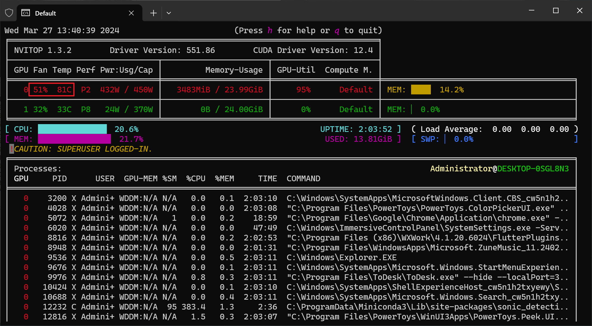

# 涡轮卡的使用技巧-风扇调速

# 问题背景

我们使用涡轮卡的时候，一旦上了负载，会得到飞机起飞的效果，噪声巨大，这在办公室不是很合适。

涡轮卡资料图：

# 解决方案

为了避免噪声过大，我们可以使用一个软件调整风扇温度曲线，它叫 MSIAfterburner，下载地址：[https://www.msi.com/Landing/afterburner/graphics-cards](https://www.msi.com/Landing/afterburner/graphics-cards)

安装好之后，进入设置页面：

然后拉低曲线，比如80度时，原本风扇转速是100%，你可以改为50%：

# 效果

修改前：

修改后：

可以看到风扇转速从 98% 降低到了 51%，噪声降低了很多。虽然使用过程中如果到了 90 度可能会过热，导致显卡降频，但是平时开发的时候完全够用了。真要跑训练的话，还是要放在机房里才行。
