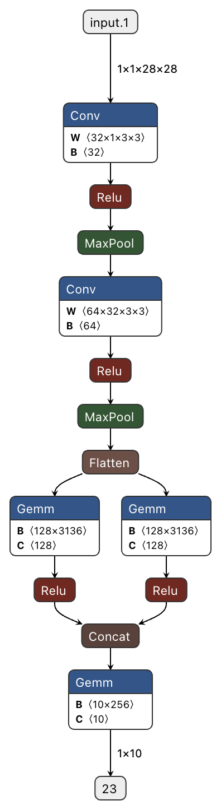
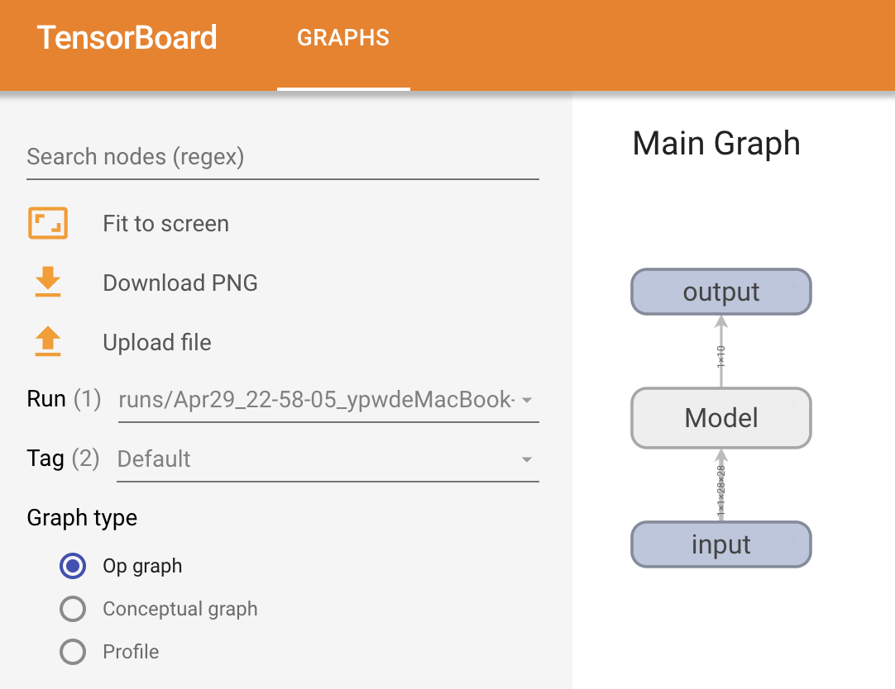
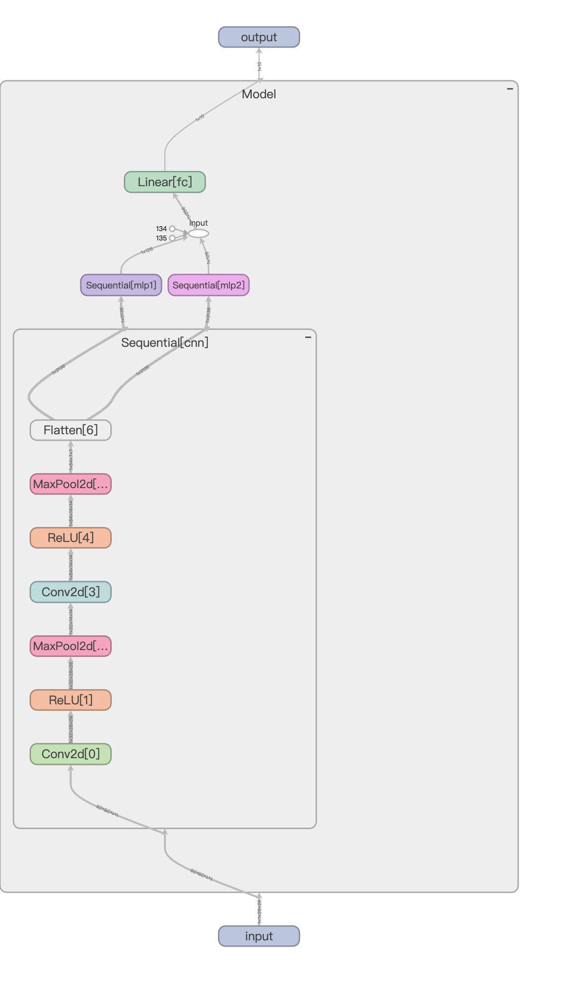
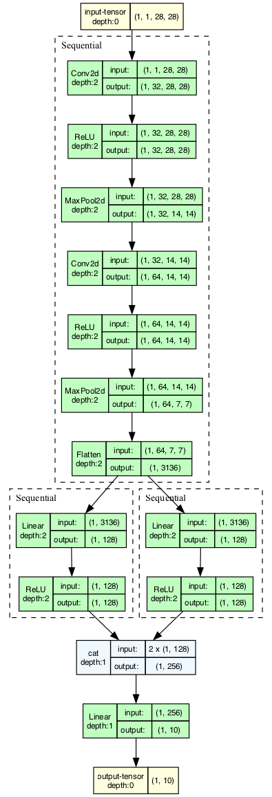
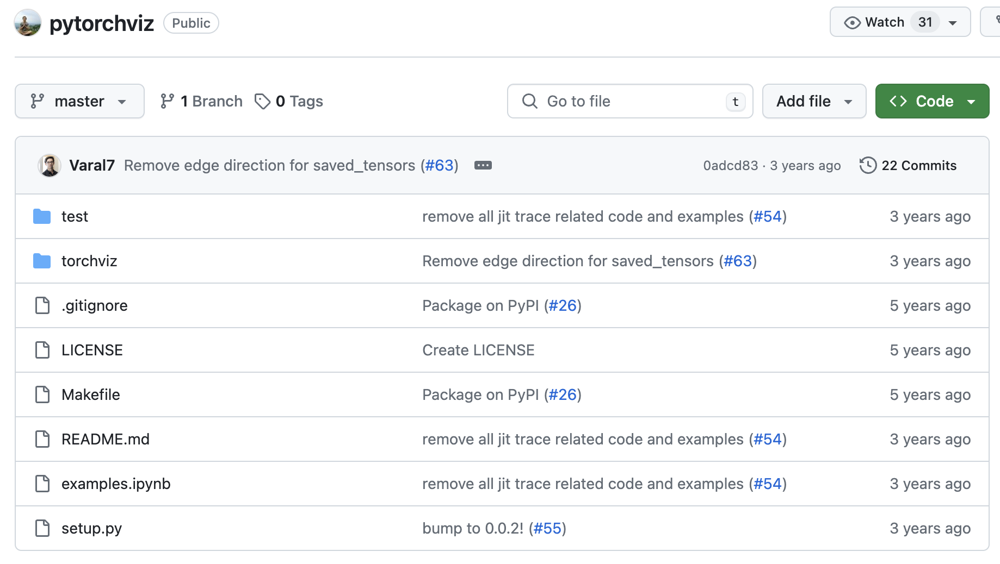
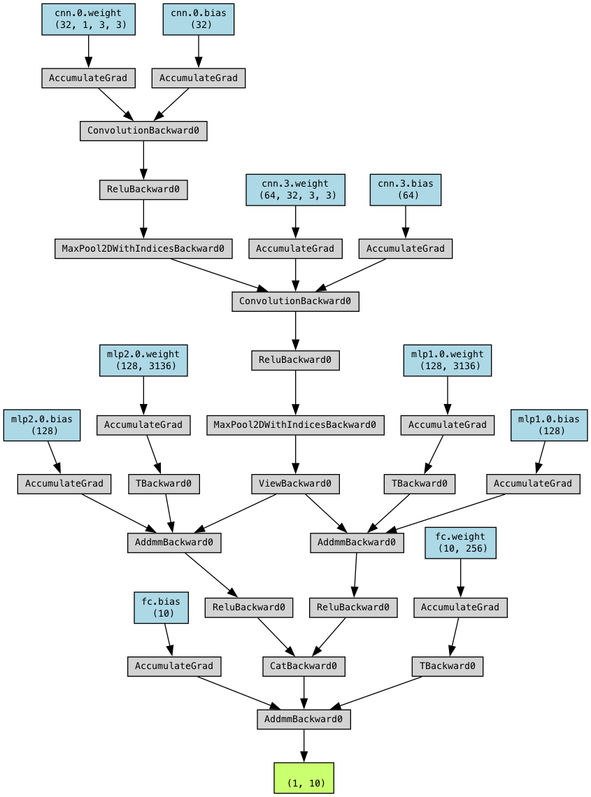

# 如何可视化 PyTorch 模型

更新时间：2024 年 4 月

## 准备模型

首先我们搭建一个简单的模型，用于演示如何可视化 PyTorch 模型。为了演示复杂模型的结构，我们在模型中加入了一个跨层连接。

```python
import torch
import torch.nn as nn

class Model(nn.Module):
    def __init__(self):
        super(Model, self).__init__()
        self.cnn = nn.Sequential(
            nn.Conv2d(1, 32, kernel_size=3, padding=1),
            nn.ReLU(),
            nn.MaxPool2d(2),
            nn.Conv2d(32, 64, kernel_size=3, padding=1),
            nn.ReLU(),
            nn.MaxPool2d(2),
            nn.Flatten(),
        )
        self.mlp1 = nn.Sequential(
            nn.Linear(7*7*64, 128),
            nn.ReLU(),
        )
        self.mlp2 = nn.Sequential(
            nn.Linear(7*7*64, 128),
            nn.ReLU(),
        )
        self.fc = nn.Linear(256, 10)
    
    def forward(self, x):
        x = self.cnn(x)
        x1 = self.mlp1(x)
        x2 = self.mlp2(x)
        x = torch.cat([x1, x2], dim=1)
        x = self.fc(x)
        return x

model = Model()

dummy_input = torch.randn(1, 1, 28, 28)
```

这里我们以 28x28 的输入为例，搭建了一个简单的卷积神经网络。

## print 大法

我们可以直接使用 print 打印模型：

```
Model(
  (cnn): Sequential(
    (0): Conv2d(1, 32, kernel_size=(3, 3), stride=(1, 1), padding=(1, 1))
    (1): ReLU()
    (2): MaxPool2d(kernel_size=2, stride=2, padding=0, dilation=1, ceil_mode=False)
    (3): Conv2d(32, 64, kernel_size=(3, 3), stride=(1, 1), padding=(1, 1))
    (4): ReLU()
    (5): MaxPool2d(kernel_size=2, stride=2, padding=0, dilation=1, ceil_mode=False)
    (6): Flatten(start_dim=1, end_dim=-1)
  )
  (mlp1): Sequential(
    (0): Linear(in_features=3136, out_features=128, bias=True)
    (1): ReLU()
  )
  (mlp2): Sequential(
    (0): Linear(in_features=3136, out_features=128, bias=True)
    (1): ReLU()
  )
  (fc): Linear(in_features=256, out_features=10, bias=True)
)
```

缺点：只能看到线性结构，看不到跨层连接。

## Netron 在线可视化

Netron 是一个经典的模型可视化工具，官网：[https://netron.app/](https://netron.app/)

代码：[https://github.com/lutzroeder/netron](https://github.com/lutzroeder/netron)

这个工具可以直接在线可视化模型，不需要安装 python 包，你只需要将模型保存为 `.onnx` 格式，然后上传到网站即可。

### 保存为 onnx 格式

```python
torch.onnx.export(model, dummy_input, "model.onnx")
```

### 使用 Netron 可视化 onnx 模型



模型可视化挺好看，跨层连接也很清晰。

## TensorBoard

官网：[https://www.tensorflow.org/tensorboard/get_started?hl=zh-cn](https://www.tensorflow.org/tensorboard/get_started?hl=zh-cn)

代码：[https://github.com/tensorflow/tensorboard](https://github.com/tensorflow/tensorboard)

代码更新频繁，每天都有更新。

### 安装 tensorboard

```bash
pip install tensorboard
```

### 使用 tensorboard

首先保存模型结构：

```py
from torch.utils.tensorboard import SummaryWriter

with SummaryWriter(comment='model') as w:
    w.add_graph(model, dummy_input)
```

然后在终端里运行 tensorboard：

```bash 
tensorboard --logdir=.
```

最后在浏览器里打开 `http://localhost:6006/` 即可看到模型结构。



这个模型结构是可以交互式展开的，比如：



不仅可以看到最里面的模型，也能看到每一层的输入输出尺寸。

## torchview

1 年未更新，目前可用。

### 安装 torchview

```bash
pip install torchview
```

### 安装 graphviz

安装 graphviz：

Mac

```bash
brew install graphviz
```

Ubuntu：

```bash
sudo apt-get install graphviz
```

参考链接：https://graphviz.readthedocs.io/en/stable/manual.html

### 使用 torchview

```python
from torchview import draw_graph

model_graph = draw_graph(model, input_size=(1, 1, 28, 28), save_graph=True, expand_nested=True)
```

可视化结果：



## torchviz

这个可视化工具比较传统，已经三年未更新：



### 安装 torchviz

安装 torchviz：

```bash
pip install torchviz
```

### 安装 graphviz

安装 graphviz：

Mac

```bash
brew install graphviz
```

Ubuntu：

```bash
sudo apt-get install graphviz
```

参考链接：https://graphviz.readthedocs.io/en/stable/manual.html

### 使用 torchviz

使用 torchviz 可视化模型：

```python
from torchviz import make_dot

dot = make_dot(model(dummy_input), params=dict(model.named_parameters()))

dot.render("model", format="png")
```



你也可以存储 dot 文件，然后手动修改样式：

```py
dot.save('vis.dot')
```

使用这个网站可以在线编辑 dot 文件：[https://dreampuf.github.io/GraphvizOnline](https://dreampuf.github.io/GraphvizOnline)

缺点：看到的是反向传播的路径，不是模型结构。

## 其他失效工具

### tensorwatch

10 个 commit 之前是四年前的代码，已不支持 PyTorch 2.x。

报错：

```
File ~/miniconda3/lib/python3.11/site-packages/tensorwatch/model_graph/hiddenlayer/summary_graph.py:85, in SummaryGraph.__init__(self, model, dummy_input, apply_scope_name_workarounds)
     81 # Switch all instances of torch.nn.ModuleList in the model to our DistillerModuleList
     82 # See documentation of _DistillerModuleList class for details on why this is done
     83 model_clone, converted_module_names_map = _to_distiller_modulelist(model_clone)
---> 85 with torch.onnx.set_training(model_clone, False):
     87     device = distiller.model_device(model_clone)
     88     dummy_input = distiller.convert_tensors_recursively_to(dummy_input, device=device)

AttributeError: module 'torch.onnx' has no attribute 'set_training'
```

### hiddenlayer

4 年未更新，10 个 commit 之前是 6 年前的代码。

报错：

```
File ~/miniconda3/lib/python3.11/site-packages/hiddenlayer/pytorch_builder.py:71, in import_graph(hl_graph, model, args, input_names, verbose)
     66 def import_graph(hl_graph, model, args, input_names=None, verbose=False):
     67     # TODO: add input names to graph
     68
     69     # Run the Pytorch graph to get a trace and generate a graph from it
     70     trace, out = torch.jit._get_trace_graph(model, args)
---> 71     torch_graph = torch.onnx._optimize_trace(trace, torch.onnx.OperatorExportTypes.ONNX)
     73     # Dump list of nodes (DEBUG only)
     74     if verbose:

AttributeError: module 'torch.onnx' has no attribute '_optimize_trace'
```

## 总结

| 工具 | 是否可用 | 更新频率 | 优点 | 缺点 |
| --- | --- | --- | --- | --- |
| Netron | 可用 | 高 | 在线可视化，不用安装 | 需要保存为 onnx 格式，看不到输入输出的尺寸 |
| tensorboard | 可用 | 高 | 可交互式展开，可视化效果好 | 需要安装 tensorboard，并且启动后台服务 |
| torchview | 可用 | 1 年 | 可以看到每一层的输入输出尺寸 | 需要安装 torchview 和 graphviz |
| torchviz | 可用 | 3 年 | 无 | 看到的是反向传播的路径，不是模型结构 |
| print 大法 | 永久可用 | 无 | 永久可用，不会失效 | 只有文字，无法展示跨层连接 |
| tensorwatch | 失效 | 4 年 | 无 | 无 |
| hiddenlayer | 失效 | 4 年 | 无 | 无 |
