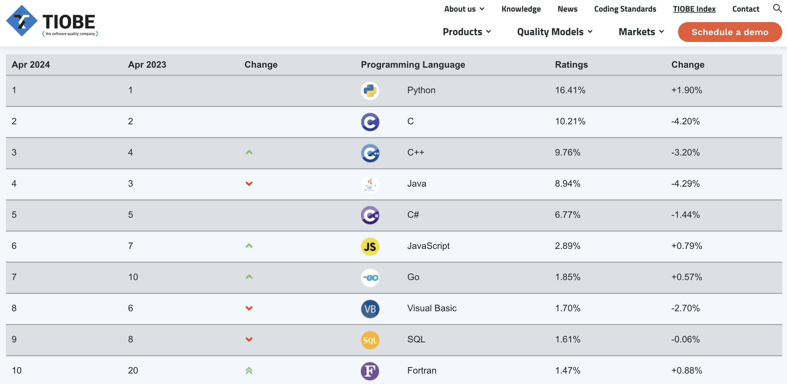
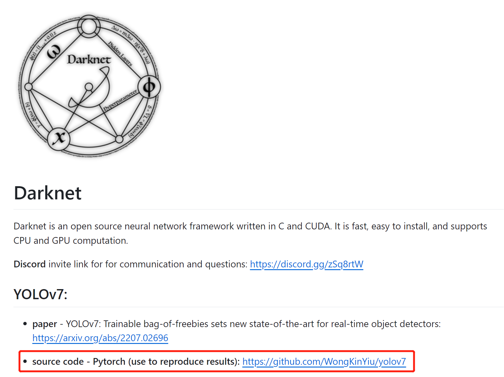

# 为什么我们要用 Python 语言

# 什么是Python语言

Python是一种高级、通用的编程语言，由Guido van Rossum于1989年底发起，并在1991年首次发布。Python的设计哲学强调代码的可读性和简洁的语法（尤其是使用空格缩进来区分代码块，而不是使用大括号或关键字）。这使得Python的代码容易理解和维护。

以下是 2024 年 4 月的编程语言排行榜，可以看到 Python 排名第一，是最流行的编程语言：



数据来源：https://www.tiobe.com/tiobe-index/

# C++、C#、Python 有什么不同

|特性/语言|C++|C#|Python|
|---|---|---|---|
|类型|编译型语言|编译型语言（运行于.NET框架/.NET Core）|解释型语言|
|性能|高性能，接近硬件层面|高性能，通过JIT编译器优化执行|性能相对较低，解释执行|
|内存管理|手动内存管理（需处理new和delete）|自动垃圾回收（无需手动管理内存）|自动垃圾回收（无需手动管理内存）|
|语法复杂度|复杂，提供多种编程范式|相对简洁，基于C++改进|简洁明了，易于学习|
|跨平台|支持，需考虑平台相关性|原生支持跨平台（.NET Core）|原生支持跨平台|
|错误处理|支持异常处理，也支持传统错误处理|强制使用异常处理|强制使用异常处理|
|标准库|标准库功能强大，但需要额外的库进行扩展|标准库提供丰富的功能，如集合、并发等|标准库提供丰富的功能，有大量第三方库支持|
|编译方式|编译为机器码或字节码|编译为中间语言（IL），由JIT编译器运行时编译|解释执行，无需编译|
|适用领域|系统/应用软件、游戏开发、嵌入式系统|桌面应用、Web应用、移动应用、游戏开发|Web开发、数据分析、机器学习、脚本编写|
|社区支持|社区庞大，历史悠久|社区活跃，由微软支持|社区庞大，快速增长|
|开发效率|相对较低，编译时间可能较长|相对较高，IDE支持良好|非常高，快速迭代和开发|

以上是这些语言之间的比较，C++性能最高，Python性能最低，但是Python使用非常简单，有非常多的库可以调用，这使得人们根本不想用C++去做AI方面的研究。

## 代码对比，以统计单词次数为例

C++：

```cpp
#include <iostream>
#include <fstream>
#include <sstream>
#include <map>
#include <string>

int main() {
    std::map<std::string, int> word_count;
    std::ifstream file("example.txt");
    std::string word;

    if (file.is_open()) {
        while (file >> word) {
            ++word_count[word];
        }
        file.close();
    } else {
        std::cerr << "Unable to open file";
        return 1;
    }

    for (const auto &pair : word_count) {
        std::cout << pair.first << ": " << pair.second << std::endl;
    }

    return 0;
}

```

C#：

```csharp
using System;
using System.IO;
using System.Collections.Generic;

class Program
{
    static void Main()
    {
        var wordCount = new Dictionary<string, int>();
        string filePath = "example.txt";

        try
        {
            using (StreamReader sr = new StreamReader(filePath))
            {
                string line;
                while ((line = sr.ReadLine()) != null)
                {
                    string[] words = line.Split(new char[] { ' ', '\t' }, StringSplitOptions.RemoveEmptyEntries);
                    foreach (string word in words)
                    {
                        if (wordCount.ContainsKey(word))
                        {
                            wordCount[word]++;
                        }
                        else
                        {
                            wordCount.Add(word, 1);
                        }
                    }
                }
            }

            foreach (KeyValuePair<string, int> pair in wordCount)
            {
                Console.WriteLine($"{pair.Key}: {pair.Value}");
            }
        }
        catch (Exception e)
        {
            Console.WriteLine($"An error occurred: {e.Message}");
        }
    }
}

```

Python：

```py
word_count = {}
with open('example.txt', 'r') as file:
    for line in file:
        words = line.split()
        for word in words:
            word_count[word] = word_count.get(word, 0) + 1

for word, count in word_count.items():
    print(f"{word}: {count}")

```

## 对比和优势

* **简洁性**：Python代码通常更短，更直观。这个例子很好地展示了如何用更少的代码行完成相同的任务。
* **可读性**：Python的语法设计使得代码更容易阅读和理解，特别是对于初学者。
* **标准库**：Python的标准库提供了大量的内置功能，使得完成一些常见任务（如文件处理、数据结构操作等）变得非常简单。
* **上下文管理器**：Python的`with`语句自动处理资源的打开和关闭，减少了出错的可能性，而在C++中需要手动管理资源。

# 在AI方面

在深度学习模型训练方面，C++、C#、Python三种编程语言提供了不同程度的支持，下面是基于这些方面的分析：

## 1. 读图和数据预处理

- **C++**: C++通常不是进行数据预处理和读图的首选语言，但可以使用OpenCV等库进行图像处理。在编码正确的情况下，和Python一致。

- **C#**: C#在数据预处理方面不如Python丰富，但可以通过Emgu CV（一个OpenCV的.NET接口）进行图像处理。在编码正确的情况下，和Python一致。

- **Python**: Python是数据预处理和读图的首选语言，拥有大量的库和框架，如Pillow、OpenCV、scikit-image（图像处理），Pandas（数据处理），NumPy（数值计算）等，这些都极大地简化了数据预处理的工作。

## 2. 使用显卡训练

- **C++**: C++可以直接调用CUDA或OpenCL等低级API来利用GPU进行计算，但这需要相对较高的专业知识。简单来说就是非常难写。

- **C#**: C#对于直接使用GPU较为不便，虽然有一些库（如Alea GPU）可以实现这一点，但并不如C++或Python中的解决方案成熟。

- **Python**: Python通过TensorFlow、PyTorch等深度学习框架提供了对GPU的高级抽象，使得使用GPU进行训练变得非常简单，并且效率非常高。这些框架背后通常都是用C++写的底层实现，确保了性能。

## 3. 反向传播和矩阵乘法

- **C++**: C++在执行矩阵乘法和反向传播等操作时通常需要直接使用BLAS（基础线性代数程序集）或手动实现，这对于非专业人士来说非常困难。

- **C#**: C#中，进行矩阵乘法和反向传播等操作通常依赖于第三方库，如`Math.NET Numerics`，但在深度学习方面的支持不如Python丰富。

- **Python**: Python通过NumPy提供高效的矩阵操作，而在深度学习框架如TensorFlow和PyTorch中，反向传播和矩阵乘法等操作都是自动化和优化的，开发者无需手动实现。

## 4. Tensor操作

- **C++**: C++中的Tensor操作通常需要依赖于特定的深度学习库，如 LibTorch 的 C++ API，但这些API相比于Python版本通常更难使用和维护。

- **C#**: C#中的Tensor操作不如Python或C++那样成熟，虽然有一些尝试（如SciSharp STACK的`TensorFlow.NET`）来桥接这个差距，但整体生态仍然有限。

- **Python**: Python是进行Tensor操作的首选语言，TensorFlow、PyTorch等框架提供了强大而灵活的Tensor操作API，使得深度学习模型的构建和训练变得非常简单。

## 5. 统计结果和可视化

- **C++**: C++在统计和可视化方面的库较少，通常需要将数据导出到Python等其他语言进行进一步的分析和可视化。

- **C#**: C#有一些用于数据分析和可视化的库，如OxyPlot和Deedle，但在深度学习领域的应用相对较少。

- **Python**: Python在统计结果和可视化方面拥有强大的库，如Matplotlib、Seaborn、Plotly等，这些库能够方便地展示深度学习模型的训练过程和结果。

Python因其丰富的库和框架，成为了深度学习模型训练的首选语言。C++和C#在某些方面可能提供更高的性能或特定的应用，但在易用性、社区支持和生态丰富度方面通常不如Python。

# 动态类型

**Python** 是一种动态类型语言，这意味着变量的类型是在运行时决定的，而不是在编译时。这为开发者提供了极大的灵活性和速度，使得快速原型设计和迭代变得更加容易。在深度学习模型训练中，这种灵活性尤其有用，因为模型的结构和数据类型可能会频繁变化。

**C++** 和 **C#** 通常被认为是静态类型语言，这意味着变量的类型在编译时就已经确定。这种类型的确定性有助于捕捉类型错误和优化性能，但可能会减慢开发速度，特别是在需要频繁修改和试验模型结构的深度学习领域。

比如 Python 写的加法函数：

```py
def add(a, b):
    return a + b

# 可以传入整数
print(add(1, 2))  # 输出: 3

# 也可以传入字符串
print(add("Hello, ", "world!"))  # 输出: Hello, world!

# 甚至可以传入列表
print(add([1, 2], [3, 4]))  # 输出: [1, 2, 3, 4]
```

下面是 C++ 写的加法函数：

```cpp
#include <iostream>
#include <string>
#include <vector>

// 整数加法
int add(int a, int b) {
    return a + b;
}

// 字符串加法
std::string add(std::string a, std::string b) {
    return a + b;
}

// 整数列表加法函数
std::vector<int> addIntLists(const std::vector<int>& a, const std::vector<int>& b) {
    // 创建一个新的vector，初始容量为a和b的元素总和，以提高效率
    std::vector<int> result;
    result.reserve(a.size() + b.size());

    // 将a的所有元素添加到result
    result.insert(result.end(), a.begin(), a.end());
    // 将b的所有元素添加到result
    result.insert(result.end(), b.begin(), b.end());

    return result;
}


int main() {
    // 整数加法
    std::cout << add(1, 2) << std::endl;  // 输出: 3

    // 字符串加法
    std::cout << add("Hello, ", "world!") << std::endl;  // 输出: Hello, world!

    // 整数列表加法
    std::vector<int> list1 = {1, 2, 3};
    std::vector<int> list2 = {4, 5, 6};
    std::vector<int> result = addIntLists(list1, list2);

    // 打印结果
    std::cout << "Result: ";
    for (int elem : result) {
        std::cout << elem << " ";
    }
    std::cout << std::endl;

    return 0;
}
```

Python 的加法函数，写一个函数就可以适用所有支持+运算的数据类型，但是C++的函数，整数要写一个，字符串要写一个，列表还要写更复杂的代码才能相加。

而如果你要支持 float 类型的列表相加，还要再写一个函数才可以。这对开发者来说太麻烦了。

对于简单的数据类型都需要这样写，如果是不同的模型对象，训练的代码就需要设计更加复杂的模板函数去兼容，时间都浪费在写代码上了。而对 Python 来说只需要写一套训练流程，即可适应各种不同的模型，只要它们都有forward函数和backward函数即可，所以动态类型对深度学习是非常有必要的。

下面是一个简单的模型训练过程：

```py
def train(dataloader, model, loss_fn, optimizer):
    model.train()
    for batch, (X, y) in enumerate(dataloader):
        X, y = X.to(device), y.to(device)

        # 计算 Loss
        pred = model(X)
        loss = loss_fn(pred, y)

        # 反向传播优化模型
        loss.backward()
        optimizer.step()
        optimizer.zero_grad()
```

该训练流程适应所有 PyTorch 搭建的模型。

参考链接：https://pytorch.org/tutorials/beginner/basics/quickstart_tutorial.html

# 一个巨星的陨落

在 YOLO、YOLOv2、YOLOv3 时代，有一个著名的深度学习训练框架叫 [Darknet](https://github.com/pjreddie/darknet)，它是使用 C 和 CUDA 编写的，作者于2018年放弃了该框架的更新，目前在它的主页写着 [YOLOv7](https://github.com/WongKinYiu/yolov7) 的广告，它是由 PyTorch 编写的：



在 YOLOv3之后，所有的 YOLO 都是 PyTorch 写的：

* YOLOv4：https://github.com/WongKinYiu/PyTorch_YOLOv4
* YOLOv5：https://github.com/ultralytics/yolov5
* YOLOv6：https://github.com/meituan/YOLOv6
* YOLOv7：https://github.com/WongKinYiu/yolov7
* YOLOv8：https://github.com/ultralytics/ultralytics
* YOLOv9：https://github.com/WongKinYiu/yolov9

# 总结

在这个星球上，大多数AI研究员都使用 Python 编写他们的模型和算法，如果你不会 Python，几乎无法从事 AI 算法的开发，因此我们选择使用 Python 开发我们的算法，以及配套的软件，只有推理框架选择使用 C++ 来开发。
