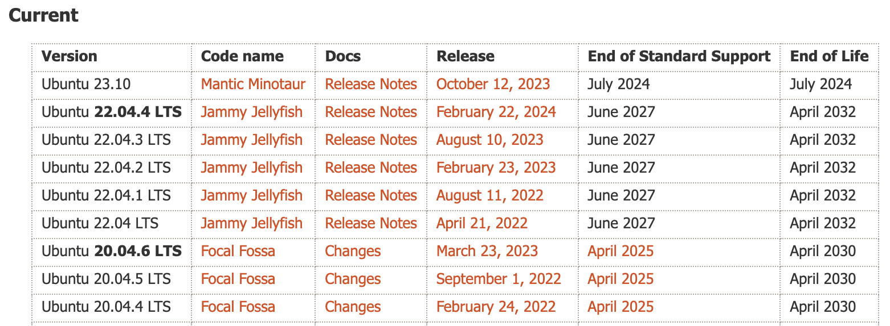
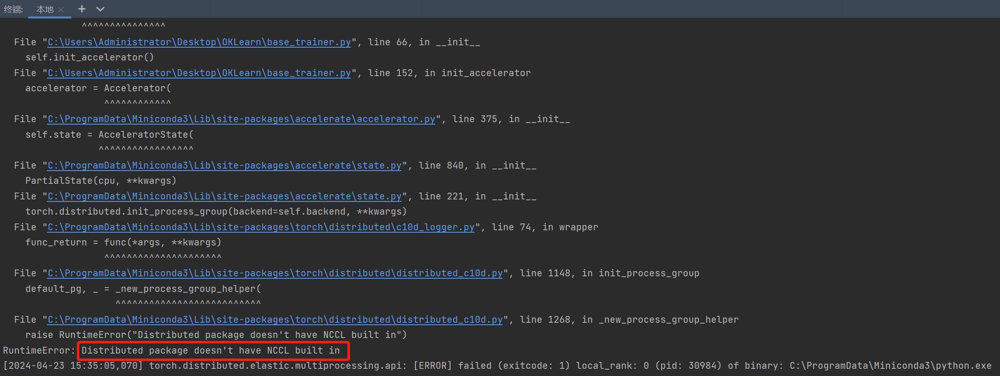

# Windows、Ubuntu 还是 macOS？

更新时间：2024 年 4 月

Windows、Ubuntu 和 macOS 这三个操作系统都有不可替代之处，我在工作中大部分情况下都会使用 macOS 作为终端，在使用 office 软件、百度云的时候会用到 Windows。虽然我直接使用的机器是 macOS 的操作系统，但是实际上运行程序的机器是 Ubuntu（Linux）操作系统。

## Ubuntu

对于深度学习工程师来说，Ubuntu 都应该是首选的操作系统，原因如下：

* 易用性强
* 使用人数多，教程多，生态好
* 各个深度学习框架的官方支持
* 各类最新技术的最先支持平台

从开发环境到部署环境，Linux 系统贯穿始终，选择一款易用的 Linux 操作系统将会缩短开发周期。

建议选择目前最新的 LTS 版本，参考链接：[https://wiki.ubuntu.com/Releases](https://wiki.ubuntu.com/Releases)

比如现在我会选择 Ubuntu 22.04.4 LTS：

## macOS

使用 macOS 的原因有很多，下面我们逐一分析。

从硬件上来说：

* 美观，苹果的工业设计是非常棒的
* 流畅，触控板的滚动和缩放效果舒适
* 视网膜显示屏，分辨率极高，高帧数流畅，高颜色的还原以及亮度和色温的控制都很恰当
* 续航时间长
* 耐用，一台苹果电脑用四五年都和刚买来一样
* iMac 5K 拥有27寸的屏幕，可以同时显示多个窗口和终端

从软件上来说：

* 美观，从系统 UI 上来说，苹果的审美是有保障的，甚至在 macOS 上开发的软件都会注重审美
* 环境与 Linux 接近，终端命令基本是通用的，在使用上无缝切换
* 更安全，全盘加密，不用担心被偷以后被窃取文件，并且由于占有率低，少有为 macOS 开发的病毒软件
* 与其他苹果设备合作很紧密，比如桌面的文件可以在每台设备上同步，甚至可以直接在 iPhone 上查看

有人可能考虑使用 macOS 外接 NVIDIA 显卡跑深度学习，这里不建议这样做。因为截止到 2019年 5 月15日，[英伟达驱动](https://www.nvidia.com/download/driverResults.aspx/147830/)只支持 2018年 7 月 9 日发布的 [macOS High Sierra 10.13.6](https://support.apple.com/kb/DL1969?locale=zh_CN)，所以我们无法用上最新版本的操作系统，官方表示[目前不支持在 macOS 10.14 上运行 CUDA](https://devtalk.nvidia.com/default/topic/1042279/cuda-10-and-macos-10-14/)，苹果也表示外接显卡[只支持 AMD 显卡](https://support.apple.com/zh-cn/HT208544)。

## Windows

这个操作系统通常是大家最为熟悉的操作系统，所以这里就不再介绍它的优点，这里只提几个缺点：

* 深度学习框架的官方支持不够及时，TensorFlow 于 2015年11月发布，但是一年之后才首次支持 Windows：[TensorFlow now builds and runs on Microsoft Windows](https://github.com/tensorflow/tensorflow/releases/tag/0.12.0-rc0)
* [PyTorch 直到 2024 年都没有支持 Windows 多卡训练](https://github.com/pytorch/pytorch/issues/42095)
* 其他学者开发的新模型的代码通常需要进行修改才能在 Windows 上运行，如果他们的代码涉及 CUDA 编程，自定义算子，这种修改会很困难
* 路径的斜杠与其他操作系统不同，Windows 使用的是 `\`，容易作为转义字符解析成其他字符导致 bug
* 换行符与其他操作系统不同，Windows 使用的不是 `\n`，而是 `\r\n`
* 命令行与其他操作系统不同，许多命令功能一样，但是名字不同，比如 ifconfig 与 ipconfig，rm 与 del 等

[bitsandbytes](https://github.com/TimDettmers/bitsandbytes) 是一个大模型量化的库，它的 8bit Adam 优化器对小显存的训练非常有用，这个库 2021 年 10 月就发布了，但是直到 2024 年 3 月才支持 Windows：[https://github.com/TimDettmers/bitsandbytes/releases/tag/0.43.0](https://github.com/TimDettmers/bitsandbytes/releases/tag/0.43.0)

**为了能够使用大多数深度学习工程师开源的代码，我们建议使用 Ubuntu 作为运行代码的机器。**
